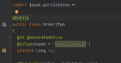
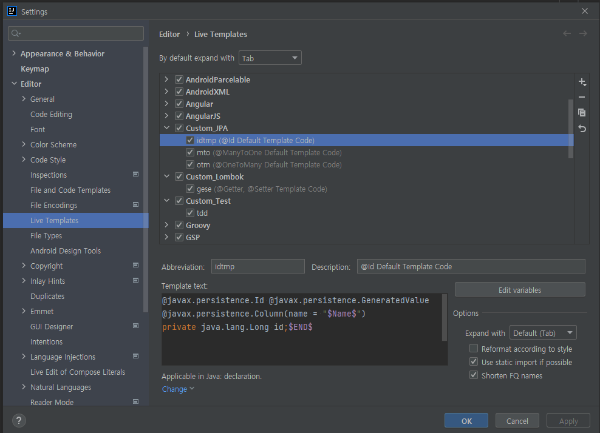
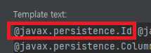
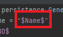
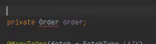
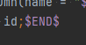

# IntelliJ IDEA Tips
- 인텔리제이 팁 저장소

## 1. 라이브템플릿
- 템플릿을 특정 예약어로 지정해두면 입력 시 자동완성시켜주는 기능

>

- ```Settings > Editor > Live Templates``` 에서 그룹, 템플릿 생성과 수정 삭제등이 가능하다.

>

### 참고사항
- 패키지 전체경로를 명시하여야 한다.

>

- ```$Name$```을 통해 사용자로부터 입력받아야할 구간을 지정할 수 있다.

>
>
>


- ```$END$```를 통해 입력 종료 시 커서가 이동될 위치를 지정할 수 있다.

>

